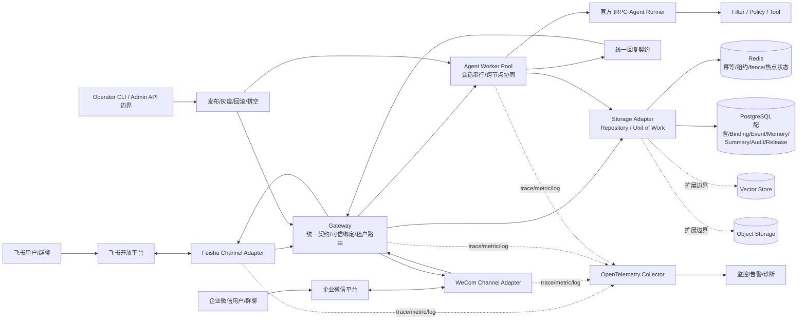
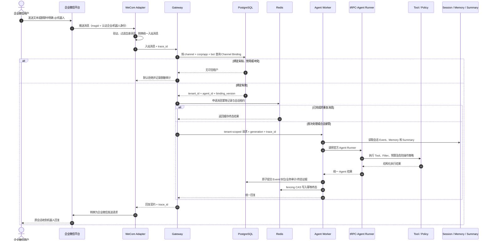

# tRPC-Agent 多租户双 IM 服务平台架构设计

## 1. 设计目标

本项目面向“多个企业、多个机器人、多个执行节点共同使用同一套 Agent 服务”的场景。它不是单一聊天机器人示例，而是一套可验证、可恢复、可扩展的多租户 Agent 消息平台：飞书与企业微信负责真实消息入口，Channel Adapter 屏蔽渠道协议差异，Gateway 完成可信身份绑定和统一路由，Worker 调用官方 tRPC-Agent Runner，Redis 与 PostgreSQL 共同保证幂等、会话连续、审计和故障恢复，并通过 OpenTelemetry、指标、日志和健康检查形成运维闭环。

核心设计原则如下：

1. **租户身份不可由外部消息声明。** 系统根据渠道类型、企业/应用和机器人身份查询 Channel Binding，未知、禁用或冲突绑定默认拒绝。
2. **消息最多执行一次，已有结果可安全复用。** 飞书 `message_id`、企业微信 `msgid` 被规范化为渠道消息键，跨节点通过幂等记录和租约协调。
3. **同一会话串行、不同会话并行。** Session 始终包含 tenant scope，避免跨租户上下文污染。
4. **结果和恢复证据可追踪。** `trace_id` 贯穿 Adapter、Gateway、Worker、Runner、回复和 Audit Log；generation/fencing 阻止失效节点继续写入。
5. **故障默认安全。** 配置、审计、认证和绑定不可用时不降级放行；部分提交恢复只补齐已有结果，不重新调用 Agent 或 Tool。
6. **基础设施可替换。** Repository/Adapter 契约隔离 InMemory、Redis、PostgreSQL、向量检索和对象存储，支持从本地验证逐步演进到生产部署。

## 2. 系统架构

### 2.1 核心组件职责

| 组件 | 职责 |
|---|---|
| Channel Adapter | 维护渠道长连接、过滤机器人自身消息、解析文本单聊和群聊明确 @、转换统一入站/回复契约、处理认证与发送错误 |
| Gateway | 校验可信 Channel Binding，生成或透传 trace，执行租户路由、幂等入口控制和稳定错误映射 |
| Agent Worker | 获取 tenant-scoped Session，按会话加锁，调用 Runner，提交事件、摘要、记忆和审计结果 |
| tRPC-Agent Runner | 复用官方 Runner 生命周期和 Agent/Tool 调用方式；自动化验收使用确定性模型，避免外部模型费用和不稳定性 |
| Storage Adapter | 通过异步 Repository/UoW 契约提供幂等、租约、配置、Event、Memory、Summary、Audit、Release 等能力 |
| Governance | 执行主体授权、内容检查、工具白名单、危险操作确认和预算状态机，依赖异常时 fail closed |
| Telemetry / Operations | 统一 trace、指标、结构化日志、健康矩阵、采样、告警、容量门禁、灰度发布、排空和回滚证据 |

## 3. 企业微信核心消息时序

`tenant_id` 只来自平台内部绑定，渠道消息标识只用于幂等。发送失败保留已完成的业务结果，由 Delivery 状态机执行有界重试；如果 Redis 终态写入失败，则依据 PostgreSQL 终态标记恢复，不重新调用 Runner。

## 4. 数据模型与租户边界

| 实体 | 关键字段/隔离边界 | 作用 |
|---|---|---|
| Tenant | `tenant_id`, status | 所有业务数据的首级隔离域 |
| Agent | tenant、agent、version | 租户内 Agent 配置和版本 |
| ChannelBinding | channel、企业/应用/机器人复合身份、tenant、agent、status | 将可信外部身份映射到内部租户，不接受外部 tenant_id |
| Session | tenant、agent、channel conversation key | 多轮上下文边界；群聊进一步包含 sender scope |
| SessionEvent | tenant、session、event_id、sequence、payload digest | 权威会话事件流，支持幂等追加和乱序拒绝 |
| MemoryRecord | tenant、agent/session scope、canonical content/reference | 长期记忆，正文或对象引用均受租户约束 |
| SummaryRecord | tenant、session、watermark、version | 与事件水位绑定；旧水位不可覆盖新水位 |
| Idempotency / Lease | channel identity、message id、generation、state | 跨节点最多执行一次、租约接管和 fencing |
| AuditLog | tenant、trace、execution、action、decision、result digest | 追加式审计、恢复与跨节点追踪 |
| Release / RuntimeConfig | version、revision、state、threshold、rollback target | 灰度门槛、配置发布、执行 pin 和回滚 |

任何 Repository 查询都必须显式携带 tenant scope。Knowledge/Vector 查询在存储边界强制注入 tenant filter；对象键使用租户命名空间，孤儿对象由可审计清理任务回收。详细字段、约束和状态机见各阶段 `data-model.md`。

## 5. 数据同步、幂等与故障恢复

- **消息幂等键**：由渠道、可信机器人/应用身份和原始消息 ID 共同构成，避免不同租户或机器人之间碰撞。
- **执行协调**：Redis 保存 processing/completed 状态、租约和热点会话；Worker 只有持有当前 generation 才能提交业务状态。
- **权威状态**：PostgreSQL 保存租户配置、Binding、Event、水位、Summary、Memory、Audit 和恢复标记；Redis 不承担不可替代的业务事实。
- **会话顺序**：同一 tenant/session 通过分布式租约串行处理；不同会话由不同 Worker 并行执行，不依赖 sticky session。
- **部分提交恢复**：数据库已提交而 Redis CAS 失败时，从终态证据补齐缓存；恢复器不得再次调用 Agent 或 Tool。
- **迁移策略**：Redis→SQL 采用显式迁移状态机和单一权威源切换点，切换前 checkpoint/双读校验，切换后禁止旧源继续写入；回滚受版本和 fencing 保护。
- **摘要一致性**：Summary 声明覆盖 watermark；低水位写入被拒，同水位不同内容视为冲突并留下审计证据。
- **渠道故障**：长连接断开由 SDK 重连；认证失败进入不可就绪；临时发送错误按 1/2/4 秒退避，永久错误和 unknown 不自动重发。

## 6. 多后端适配方案

| 后端类别 | 当前职责 | 一致性与演进策略 |
|---|---|---|
| Redis | 幂等、租约、generation/fence、热点 Session 和短期运行状态 | 低延迟协调层，可依据 SQL 终态重建 |
| PostgreSQL | Tenant/Agent/Binding、Event、Memory、Summary、Audit、Recovery、Release | 权威持久层；事务提交、版本化 schema-init、forward-only 升级 |
| Vector Store | Knowledge/Memory 语义检索扩展边界 | 当前为确定性契约替身；正式适配器必须强制 tenant filter |
| Object Storage | 图片、文件、语音和大型 Artifact 扩展边界 | 当前为确定性契约替身；数据库保存摘要、引用和生命周期状态 |
| InMemory / SDK Test Double | 单元、契约、故障注入和离线验收 | 与正式端口遵守同一契约，但不作为共享生产权威 |

本项目已经真实验证 Redis 和 PostgreSQL；向量库、对象存储交付的是可替换端口、数据语义和确定性测试替身，不宣称完成某个具体云产品的生产接入。

## 7. tRPC-Agent 复用边界

项目直接复用 `trpc-agent-py==1.1.19` 的 `LlmAgent → Runner → Event → SessionService` 主链路、Tool callback 以及官方 OpenTelemetry instrumentation，不另造模型运行框架。平台新增双 IM Channel Adapter、统一消息契约、可信 Channel Binding、多租户 Gateway、跨节点幂等/租约/fencing、部分提交恢复、治理与预算状态机、多后端 Repository、可观测性和灰度发布/回滚。该边界既保留官方框架语义，也补齐企业消息平台的隔离、可靠性和运维能力。

## 8. 生产风险及缓解

| 风险 | 缓解措施 |
|---|---|
| 外部伪造 tenant_id 导致越权 | 只信任复合 Channel Binding，未知、禁用和冲突绑定默认拒绝 |
| 渠道重复投递造成重复副作用 | 原始消息 ID 幂等、终态缓存、SQL 恢复标记 |
| 旧 Worker 接管后继续写入 | generation/fencing 覆盖全部业务写入 |
| 同一会话并发破坏上下文 | tenant/session 级租约串行化，不同会话并行 |
| SQL 已提交但 Redis 更新失败 | 依据 SQL 终态补齐缓存，不重放 Agent/Tool |
| 渠道断线或回复发送失败 | SDK 重连、认证错误分级、Delivery 状态机和有界重试 |
| Secret 进入代码、日志或 trace | 进程环境/Secret Provider 注入、属性白名单和仓库安全扫描 |
| Summary 或迁移覆盖新数据 | watermark/version CAS、单一权威源切换和可回滚迁移状态机 |
| 遥测故障拖垮业务 | 有界缓冲、分级采样和失败隔离；审计仍保持 fail closed |
| 灰度版本扩大故障面 | 硬门槛自动回滚、质量门槛暂停、Worker 排空和版本化证据 |

包含触发条件、检测信号、处置步骤、恢复验证和剩余风险的完整登记见 [risk-register.md](specs/008-observability-operations-flow/risk-register.md)。

## 9. 部署与证据边界

已实现的最小可观察拓扑由 Docker Compose 启动 Redis、PostgreSQL、schema-init、Gateway、Worker-A、Worker-B 和 OpenTelemetry Collector，并提供 `/health/live`、`/health/ready`。本地故障演练验证 Collector 中断不影响业务、Worker 排空后由另一节点接管、共享状态和审计可恢复。

生产推荐使用多 Gateway、每渠道至少两个 Adapter、多 Worker、HA PostgreSQL、HA Redis、两层 Collector、外部 Secret Provider 和独立 Operator；该部分是可落地设计建议，不等同于本项目已部署 Kubernetes、跨地域 HA 或获得生产 SLA。

## 10. 验证结论

项目采用 Spec-Driven Development 与测试驱动开发。每个任务先建立失败断言（Red），再完成满足契约的最小实现（Green），随后重构并运行定向及全量回归（Refactor）。最终在真实 Docker Compose 环境中完成共享后端、schema 升级、健康检查、遥测故障和 Worker 接管验证：**620 passed、0 skipped、0 failed、2 个第三方飞书 SDK 弃用警告**。所有结论均可追溯到规格、决策、测试命令和验证记录。
