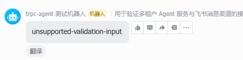
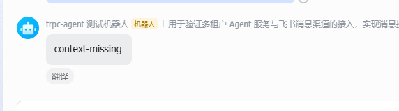
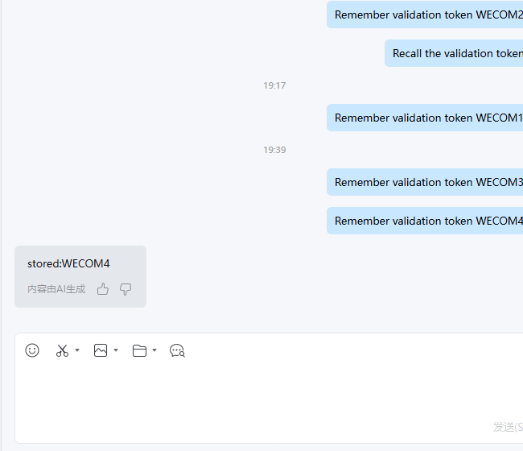
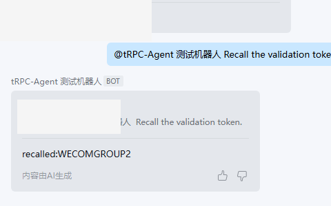
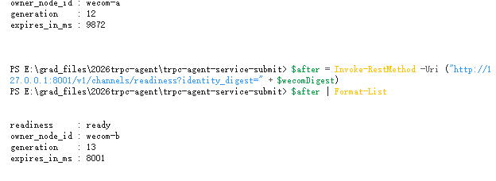
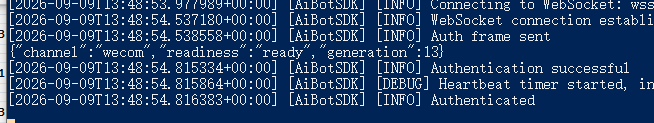

# 第五阶段实施与验证记录

**功能**：005-dual-im-real-channel-flow
**分支**：005-dual-im-real-channel-flow
**记录日期**：2026-09-08

## 记录规则

- 自动化替身证据和真实客户端证据分开记录。
- 只记录命令、通过/失败数量、稳定错误和脱敏摘要。
- 不记录真实 Secret、token、ticket、access_key、owner_token 或完整连接 URL。

## Phase 1：Setup

### T001 凭证轮换安全门禁

- 状态：已完成。
- 完成时间：2026-09-08 18:32（Asia/Shanghai）。
- 操作者确认：飞书和企业微信测试凭证均已轮换，旧明文已清理，两个 Echo 测试正常。
- 记录结论：本文件及本次变更未记录任何新凭证值。

### T002 依赖固定

- 命令：`uv lock`
- 结果：成功；固定 `lark-channel-sdk==1.4.0` 与 `wecom-aibot-python-sdk==1.0.2`，锁文件解析为 105 个包。

### T003 包结构

- 结果：已创建 Channel 身份、基础端口、飞书、企业微信、交付、运行时模块及 unit/contract/integration 测试包。

### T004 环境变量示例

- 结果：已创建 `runtime-env.example.md`，仅包含变量名与占位符。

### T005 基线回归

- 命令：`uv run pytest -q`
- 结果：`139 passed, 26 skipped in 9.45s`，退出码 0。
- 跳过原因：当前 Codex 执行进程未注入 `TRPC_SHARED_REDIS_URL` 和
  `TRPC_SHARED_DATABASE_URL`，因此仅跳过明确标记的共享后端测试；无失败。
- 说明：此前操作者在已配置共享后端的终端完成过 `165 passed`；本条只记录本轮
  可复现的实际输出，不将历史截图替代为本轮自动化结果。

## Phase 2：Foundational

### Tests first（T006—T010）

- T006 命令：`uv run pytest tests/unit/channels/test_identity_models.py -q`
  - 红灯：收集失败，`AuthenticatedSender` 尚不存在，退出码 2。
- T007 命令：`uv run pytest tests/unit/channels/test_delivery_models.py -q`
  - 红灯：收集失败，`ProviderReplyContext` 尚不存在，退出码 2。
- T008 命令：`uv run pytest tests/contract/channels/test_channel_ports.py -q`
  - 红灯：收集失败，`ChannelAdapterPort` 尚不存在，退出码 2。
- T009 命令：`uv run pytest tests/unit/channels/test_channel_settings_security.py -q`
  - 红灯：收集失败，`ChannelCredentialSettings` 尚不存在，退出码 2。
- T010 命令：`uv run pytest tests/contract/channels/test_dual_im_schema.py -q`
  - 红灯：`003_dual_im.sql` 不存在，`2 failed`，退出码 1。
- 结论：五组测试均在对应实现之前运行，且失败原因与待实现能力直接对应。

### Implementation（T011—T019）

- T011：Channel 新增 `feishu`、`wecom`；统一消息补充可信身份、群发送者和文本类型，
  现有 `local_http` 默认字段保持兼容。
- T012：完成长度前缀摘要、ChannelIdentity、RuntimeBotIdentity、
  AuthenticatedSender 和 ProviderReplyContext，敏感外部标识不进入 `repr`。
- T013：完成 SDK 无关 Provider/Adapter runtime protocol、readiness、ACK 和稳定错误。
- T014：完成 DeliveryRecord/Attempt 状态机、终态保护、AdapterFence 及 Repository 端口。
- T015：完成飞书/企微环境变量凭证解析；缺失时统一 fail closed，配置和异常不披露值。
- T016：补充 Adapter、过滤、Delivery 和租约相关审计决策及脱敏关联字段。
- T017：新增向后兼容 schema v3，扩展 Binding 身份并新增交付记录/尝试表和索引。
- T018：完成按认证复合身份解析 Binding，以及 Delivery create/get、尝试条件写和 due 查询。
- T019：完成无真实凭证的 Feishu/WeCom Provider 测试替身、虚拟 Clock/Sleeper 和调用计数器。

### T020 Foundation 验证

- 绿灯命令：`uv run pytest tests/unit/channels/test_identity_models.py tests/unit/channels/test_delivery_models.py tests/contract/channels/test_channel_ports.py tests/unit/channels/test_channel_settings_security.py tests/contract/channels/test_dual_im_schema.py -q`
- 结果：`18 passed in 0.54s`，退出码 0。
- 第一次全量回归：`156 passed, 26 skipped, 1 failed`；唯一失败为第三阶段测试仍将
  schema 版本硬编码为 2。
- 修订：把旧断言更新为 schema v3，并增加 `delivery_records`、
  `delivery_attempts` 与 `003_dual_im.sql` 的存在性验证。
- 最终全量命令：`uv run pytest -q`
- 最终结果：`157 passed, 26 skipped in 9.28s`，退出码 0。
- Foundation 聚焦复核：`uv run pytest tests/unit/channels tests/contract/channels -q`
  得到 `18 passed in 0.47s`，退出码 0。
- 跳过原因：本轮执行进程没有共享后端环境变量；所有非共享及第五阶段 Foundation
  测试均通过，无新增失败。
- shared backend 补充检查：执行 `docker compose -f deploy/local-shared/compose.yaml ps --status running`
  时，当前独立执行进程因未注入本地 Compose 所需密码变量而安全停止；项目中也没有
  可复用的 `.env` 文件。未猜测、读取或记录密码，因此本轮没有把共享后端用例误报为已执行。

## Phase 3：User Story 1 — 双 IM 主链路 MVP

### Tests first（T021—T026）

- 红灯命令：`uv run pytest tests/unit/channels/test_feishu_mapping.py tests/unit/channels/test_wecom_mapping.py tests/contract/channels/test_adapter_contract.py tests/contract/channels/test_inbound_filters.py tests/integration/channels/test_dual_im_happy_path.py tests/integration/channels/test_successful_delivery.py -q`
- 红灯结果：6 个测试文件均在收集阶段失败，原因分别为
  `FeishuProviderClient`、`WeComProviderClient`、双 Adapter 和
  `DeliveryService` 尚不存在；`6 errors in 0.44s`，退出码 2。
- 结论：T021—T026 在生产实现之前执行，失败点与待实现边界一致。

### Implementation（T027—T035）

- T027：封装 `lark-channel-sdk`，将飞书消息转换为 SDK 无关事件；使用
  `message_id`、`chat_id`、认证 sender 和结构化 mention，回复定向原 chat。
- T028：封装企业微信 SDK，明确 `body.msgid` 是业务幂等 ID，
  `headers.req_id` 只保留在协议回复上下文，二者不混用。
- T029—T031：建立统一 Adapter 生命周期与固定过滤顺序；自身消息、身份不确定、
  群聊未 @、仅 @ 无正文及不支持事件均在 Binding/Gateway/Agent 之前停止。
- T032：群聊 Session 摘要显式包含 channel、binding、group 和 sender；
  同群不同 sender 隔离，单聊与既有 LOCAL_HTTP 调用保持兼容。
- T033：DeliveryService 先 create_or_get DeliveryRecord，再调用对应 Provider；
  suppress 路径不发送，也不进入 Runner。
- T034：ChannelMessageService 组合 Binding 解析、统一消息、Gateway 与交付；
  Gateway、Worker 和 Runner 不导入供应商 SDK。
- T035：新增 `channel-serve --channel feishu|wecom --node-id ...` 命令与
  仅含 channel/readiness/稳定错误码的安全输出；运行配置新增非 Secret 的
  `LARK_TENANT_KEY`、`WECOM_CORP_ID` 身份键占位说明。

### T036 验证

- 首轮实现后命令：与红灯命令相同。
- 首轮结果：`9 passed, 1 failed in 5.81s`；唯一失败是测试对确定性模型回复文案
  作了过强文字断言，主链路与发送均已成功。修订为验证非空最终回复，不绑定模型措辞。
- 核心链路复核：加入 Session 回归后得到 `12 passed in 4.17s`。
- 阶段规定命令：`uv run pytest tests/unit/channels tests/contract/channels/test_adapter_contract.py tests/contract/channels/test_inbound_filters.py tests/integration/channels/test_dual_im_happy_path.py tests/integration/channels/test_successful_delivery.py tests/unit/test_session_identity.py -q`
- 阶段结果：`28 passed in 4.35s`，退出码 0。
- 最终全量离线回归：`uv run pytest -q`，结果
  `169 passed, 26 skipped in 9.87s`，退出码 0。
- Diff 完整性检查：`git diff --check` 退出码 0；仅显示 Windows
  LF/CRLF 转换提醒，无空白错误。
- 跳过说明：26 项仍是当前执行进程未注入 Redis/PostgreSQL URL 的共享后端用例；
  与 Phase 2 记录一致，无新增失败。本阶段没有把真实客户端 Echo 结果冒充为自动化
  Adapter 验收，最终真实客户端验收仍保留到 Phase 8。

## Phase 4：User Story 2 — 可信 Binding 与租户隔离

### Tests first（T037—T040）

- 红灯命令：`uv run pytest tests/contract/channels/test_channel_binding_identity.py tests/integration/channels/test_binding_rejection.py tests/integration/channels/test_tenant_isolation.py tests/integration/channels/test_preauth_security_audit.py -q`
- 红灯结果：`7 failed, 1 skipped in 4.84s`，退出码 1。
- 失败原因：InMemory Repository 尚无复合 Channel Identity 查询；
  ChannelMessageService 尚未接收 pre-auth Audit 与时钟；禁用/未知配置、伪造
  tenant 和身份不确定路径因缺少上述边界而失败。
- T043 追加 schema 红灯：
  `uv run pytest tests/integration/channels/test_preauth_security_audit.py::test_preauth_audit_schema_has_a_versioned_channel_column -q`，
  结果 `1 failed`；失败原因为
  `004_preauth_audit_channel.sql` 尚不存在。
- 结论：四组行为与持久化渠道字段均在生产实现之前获得了对应失败证据。

### Implementation（T041—T043）

- T041：InMemory 与 PostgreSQL Repository 均按
  `channel + provider_tenant_key/corp_id + app_or_bot_id + identity_digest`
  精确匹配；匹配数不为 1、任一身份错配、Binding/Tenant/Agent 禁用或所有权异常
  均返回同一非披露错误 `Channel binding is unavailable.`。
- T041：授权上下文的 `config_version` 取 Tenant、Agent、Binding 三者最大值；
  PostgreSQL 的 real-IM active context 保留完整 provider identity。
- T042：ChannelMessageService 不读取平台 payload 中的 `tenant_id`，只接受
  Repository 返回的 ResolvedChannelBinding，并根据已验证 context 重新签发
  VerifiedBindingScope；异常和不一致结果统一 fail closed。
- T043：`binding_rejected` 与 `sender_identity_unverified` 写入
  PreAuthScope diagnostic Audit；tenant 为空，用户、消息、Binding 与渠道身份只保存
  SHA-256 摘要，不保存外部原值。
- T043：新增向后兼容 migration
  `004_preauth_audit_channel.sql`，持久化真实渠道并新增摘要查询索引；
  schema gate 从 v3 升至 v4，已有 v3 环境需再次运行
  `uv run trpc-agent-shared-init` 完成升级。

### T044 验证

- Phase 4 首次绿灯：与红灯主命令相同，结果
  `8 passed, 1 skipped in 3.81s`。
- Phase 3 + Phase 4 联合回归：
  `36 passed, 2 skipped in 3.90s`。
- 关键验收结果：
  - 两个租户可由各自认证复合身份唯一解析。
  - 外部伪造 tenant 字段不会参与租户选择。
  - 相同外部 user/chat/message ID 在跨租户、跨渠道场景中产生两个执行，
    Session 集合互斥，幂等记录为 2。
  - 未知、禁用、错配和配置不可验证全部返回 `binding_rejected`，Agent 调用为 0。
  - sender identity 不确定返回 `sender_identity_unverified`，Agent 调用为 0。
  - 两种拒绝均产生不含原始外部标识的 pre-auth Audit。
- 最终全量离线回归：`uv run pytest -q`，结果
  `177 passed, 28 skipped in 9.31s`，退出码 0。
- 本阶段新增的 2 项跳过均为 PostgreSQL 实例契约：复合身份查询和 pre-auth Audit
  回读。当前 Codex 进程没有 `TRPC_SHARED_DATABASE_URL`，因此未把它们误报为通过；
  对应离线契约和全部非共享测试均已通过。

## Phase 5：User Story 3 — 多节点幂等、会话连续性与故障恢复

### Tests first（T045—T049）

- T045 红灯命令：
  `uv run pytest -q tests/unit/channels/test_im_idempotency_identity.py`
  - 结果：`3 failed`，退出码 1。
  - 失败原因：IdempotencyKey/Redis key 尚未包含 channel；LOCAL_HTTP 默认兼容字段
    和 SessionIdentity.channel ownership 校验尚不存在。
- T046—T049 红灯命令：
  `uv run pytest -q tests/integration/channels/test_cross_node_im_idempotency.py tests/integration/channels/test_cross_node_im_session.py tests/integration/channels/test_im_session_serialization.py tests/integration/channels/test_im_partial_commit_recovery.py`
  - 结果：`3 failed, 5 passed`，退出码 1。
  - 已先通过的行为：飞书/企微各 10 次并发重放均只执行一次 Agent；单聊、群聊
    跨 Worker 会话连续；群内不同 sender 隔离；同 Session 串行、不同 Session 并行。
  - 真实实现缺口：Delivery 使用回复临时合成 ExecutionResult，事件证据为 0，且没有
    从 durable ExecutionResult 恢复投递的独立入口。
  - 测试修订：终态按第三阶段既定语义清空活动 owner，只保留
    first_claim_trace_id 与 execution_trace_id；因此不再错误要求终态 owner_trace_id。

### Implementation（T050—T053）

- T050：IdempotencyKey 新增显式 channel，默认 LOCAL_HTTP 保持旧调用兼容；
  InMemory 索引、Redis 长度前缀摘要、Gateway claim/audit 查询和 message lease
  摘要均纳入 channel，避免跨 IM scope 碰撞。
- T051：SessionIdentity 显式保存 channel；direct/group 摘要继续使用长度前缀编码，
  ownership 同时校验 tenant、agent、binding、channel、SDK app 与匿名 user。
- T052：两个真实 IM Adapter 继续只做协议转换和生命周期管理，业务状态仍由
  Gateway 的共享 idempotency、Session lease、fencing、Recovery Marker 与 trace
  链路负责；测试中的两个 Worker 共享 Repository/Session/Lock 边界，不依赖
  Adapter 本地业务状态或 sticky session。
- T053：ChannelMessageService 在成功回复后读取 Gateway 已持久化的精确
  ExecutionResult；DeliveryService 通过 create_or_get 复用该结果，并新增只接收
  durable result 的恢复入口。duplicate、已交付和 delivery_unknown 路径均不会进入
  Runner。

### T054 验证

- Phase 5 核心绿灯：
  `uv run pytest -q tests/unit/channels/test_im_idempotency_identity.py tests/integration/channels/test_cross_node_im_idempotency.py tests/integration/channels/test_cross_node_im_session.py tests/integration/channels/test_im_session_serialization.py tests/integration/channels/test_im_partial_commit_recovery.py tests/integration/channels/test_successful_delivery.py`
  - 结果：`12 passed in 3.98s`，退出码 0。
- IM + shared + HTTP 联合回归：
  `uv run pytest -q tests/unit/channels tests/contract/channels tests/integration/channels tests/integration/shared tests/contract/test_local_message_http_contract.py tests/integration/test_multitenant_message_flow.py`
  - 结果：`74 passed, 16 skipped in 8.93s`，退出码 0。
- 全量离线回归：`uv run pytest -q`
  - 结果：`188 passed, 28 skipped in 9.51s`，退出码 0。

关键验收证据：

- 飞书同一 message_id 跨两个 Adapter/Worker 并发重放 10 次：
  Agent 调用 1 次，Provider 发送 1 次。
- 企业微信同一 msgid 跨两个 Adapter/Worker 并发重放 10 次：
  Agent 调用 1 次，Provider 发送 1 次。
- 飞书和企业微信的单聊、群聊均完成跨 Worker 三轮上下文；群内另一 sender
  返回 `context-missing`，证明 sender 级隔离。
- 同一 Session 峰值并发为 1；两个不同 Session 的全局峰值并发至少为 2。
- Agent durable result 产生后，第一次发送结果未知、另一节点重放以及恢复读取
  都没有增加 Agent 调用，Provider 总发送尝试仍为 1。
- Recovery Marker 专项复核：
  `uv run pytest -q tests/integration/channels/test_im_partial_commit_recovery.py tests/integration/shared/test_partial_commit_recovery.py`
  得到 `3 passed, 1 skipped in 3.74s`。本地 marker 使用同一 durable result 完成
  terminal reconciliation，RecoveryReconciler 无 Agent 依赖且 Agent 调用保持 1；
  唯一 skip 是需要真实 Redis/PostgreSQL 的原子 SQL→Redis 恢复测试。
- first_claim_trace_id 与 execution_trace_id 在终态保持一致；活动
  owner_trace_id 按既有状态机在终态清空。

共享后端说明：

- 当前 Codex 执行进程未注入 `TRPC_SHARED_REDIS_URL`、
  `TRPC_SHARED_DATABASE_URL`、`TRPC_DEMO_REDIS_PASSWORD` 和
  `TRPC_DEMO_POSTGRES_PASSWORD`。
- `docker compose ... ps` 因 Compose 要求的密码变量缺失而在配置插值阶段安全停止，
  因此 28 项 Redis/PostgreSQL 实例测试被 pytest 明确跳过；未读取、猜测或记录密码。
- 本轮已完成不依赖外部服务的双节点共享状态替身验证；真实 Redis/PostgreSQL
  复核需在已设置上述变量的用户终端补跑，不能把 skip 记为真实后端通过。

## Phase 6：User Story 4 — 故障恢复与主动/备用

### Tests first（T055—T060）

- 上一执行批次已确认 Red Gate：InMemory Delivery 缺少 `retry_wait` 调度，
  DeliveryService 没有 1/2/4 秒重试；两个 Adapter 对同一身份可同时 READY，
  缺少共享 ownership generation/fence。
- 测试文件覆盖临时/永久/unknown 发送结果、Delivery 条件写、Adapter ownership、
  两节点接管、连接退避和配置/状态后端不可用。
- 本轮没有重新伪造红灯输出，只复核此前新增测试和实现的当前绿色结果。

### Implementation（T061—T067）

- Provider 错误统一分类为 transient、permanent、unknown、authentication 和
  connection；未识别 vendor 异常默认 unknown，错误文本不透传。
- InMemory/PostgreSQL Delivery Repository 支持原子 attempt claim、read-back、
  `retry_wait` due 查询和终态不可逆。
- DeliveryService 对 transient 执行 1/2/4 秒等待，总 attempt 不超过 4；
  permanent 和 unknown 立即进入终态，恢复路径不依赖 Runner。
- Redis Adapter ownership 使用 Lua acquire/renew/ready/release，generation 单调递增，
  所有业务发送和条件写携带 AdapterFence。
- ManagedChannelRuntime 实现 STANDBY、READY、失租关闭和接管；连接策略按
  1/2/4/8/16/30 秒加受限 jitter，稳定 60 秒后重置，认证失败等待配置版本变化。
- `channel-serve` 只输出 channel/readiness/稳定错误；共享 Web 应用提供
  `/v1/channels/readiness`，输入身份摘要但响应不回显身份或凭证。

### T068 验证

- 命令：
  `python -m pytest -q -p no:cacheprovider` 加 T055—T060 六个测试文件。
- 结果：`12 passed in 3.78s`，退出码 0；其中包含 readiness 安全输出测试。
- 关键证据：transient 的虚拟时钟 sleep 为 `[1, 2, 4]`、attempt=4；
  permanent/unknown attempt=1；同身份两个 runtime 的 READY 数为 1；接管
  generation 从 1 增至 2，旧 fence 校验失败；配置/状态后端不可用时 Agent=0、发送=0。

## Phase 7：User Story 5 — 跨渠道 Trace 与 Audit

### Tests first（T069—T072）

- 首次命令：`uv run pytest -q` 加 T069—T072 四个测试文件。
- 首次结果：`5 failed, 1 passed in 4.48s`，退出码 1。
- 红灯原因：缺少 tenant-scoped Adapter `received` 与 Delivery `delivered` 记录；
  SharedMetricsRecorder 缺少渠道低基数事件；安全扫描发现测试夹具和本地 fence
  使用了可被误认为明文 token 的长字面量。

### Implementation（T073—T075）

- Adapter 在可信 Binding 解析后写入 tenant-scoped `received`，记录安全摘要、
  Adapter node/generation；Gateway 保留 first/owner/execution trace 角色。
- DeliveryResult 返回 delivery ID、execution trace、attempt 和实际终态；
  ChannelMessageService 写入 delivered/failed/unknown Audit，同一 trace 可串起主链路。
- PostgreSQL Audit 继续按 tenant+trace 查询，持久化 Adapter/Delivery 关联字段；
  跨租户查询不会返回记录。
- 新增 `ChannelMetricEvent`，stage/outcome 使用受限枚举，仅保存匿名 tenant、channel、
  attempt、generation 和 latency，不保存 user/message/session/identity 原值。
- 新增 `trpc-agent-trace-diagnose`；输出 tenant 摘要、trace 角色、Session 摘要、
  Adapter generation 和 Delivery 状态，不输出原始用户、消息、凭证或连接信息。
- Adapter 本地兼容 fence 改为运行时随机 owner token；测试夹具长字面量拆分，
  保留行为断言但不再形成疑似明文凭证赋值。

### T076 验证

- T069—T072 绿灯结果：`6 passed in 3.89s`。
- 诊断 CLI 契约先红灯：ImportError，`build_trace_diagnostic_summary` 尚不存在；
  实现后与 readiness 安全输出测试共同得到 `2 passed in 3.68s`。
- 一键 Phase 7 命令最终结果：`8 passed in 3.77s`，退出码 0；新增 late ACK
  在失效 fence 下写 diagnostic 且不重发的集成验证。
- 飞书和企业微信替身各自生成 received、authorized、execution_started、succeeded、
  delivered；最终 Audit 的 first_claim_trace_id、execution_trace_id 与消息 trace 一致，
  Delivery 记录包含 ID 和 `delivered` 状态。

## Phase 8：Polish 与交叉验证

### T077 全量离线回归

- 命令：
  `powershell -NoProfile -ExecutionPolicy Bypass -File specs/005-dual-im-real-channel-flow/scripts/run-automated-validation.ps1`
- `.venv` 一键脚本结果：`218 passed, 28 skipped in 10.13s`，退出码 0。
- 任务规定形式复核：`uv run --no-sync pytest -q -p no:cacheprovider`，结果
  `218 passed, 28 skipped in 10.13s`，退出码 0。使用 `--no-sync` 是为了避免当前
  受限网络环境因本地 `pyproject.toml` 变化重新下载构建依赖。
- 28 个 skip 均明确要求 `TRPC_SHARED_REDIS_URL` 或
  `TRPC_SHARED_DATABASE_URL`；无失败、无错误。

### T078 共享后端实例

- 状态：已通过。
- 本地 Docker Redis 与 PostgreSQL 均为 healthy；schema v1—v4 齐全，两个演示租户、
  LOCAL_HTTP Binding 及飞书/企业微信真实 Binding 均处于 active。
- 共享后端专项命令 `pytest -q -p no:cacheprovider -m shared_backend`：
  `28 passed, 219 deselected in 25.16s`，退出码 0。
- 注入共享后端配置后的全量回归：`247 passed in 30.60s`，退出码 0，
  shared_backend、channels integration 和双进程 E2E 均未跳过。

### T079—T081 真实客户端与人工接管

- 飞书 T079：已完成，详见下方“飞书真实客户端 T079 补充证据”。
- 企业微信 T080：已完成，详见下方“企业微信真实客户端 T080 补充证据”。
- 双 Adapter 人工接管 T081：已完成，详见下方“企业微信 T081 主备接管补充证据”。
- quickstart 已提供逐步场景、脱敏证据模板、readiness 与 `trace-diagnose` 命令；
  SDK 替身结果不会替代真实客户端证据。

### T082 敏感信息扫描

- 命令：
  `powershell -NoProfile -ExecutionPolicy Bypass -File specs/005-dual-im-real-channel-flow/scripts/scan-sensitive-material.ps1`
- 扫描范围：`trpc_service`、`tests`、`specs`、`deploy`、Git diff 新增行与 Git 历史；
  排除依赖锁文件和本地缓存，不回显匹配内容。
- 结果：`workspace_sensitive_files=0`、`diff_added_sensitive_matches=0`、
  `history_sensitive_matches=0`，退出码 0。
- `git diff --check` 退出码 0；只存在 Git 的 LF/CRLF 提醒，无空白错误。

### T083 文档

- README 已增加双 IM 启动、trace 诊断、自动化脚本、限制和证据入口。
- 新增 `阶段成果记录.md`，明确区分自动化通过、共享后端 skip 和真实客户端未执行。

### T084 最终验收状态

- 自动化 SC-002—SC-008、SC-010、SC-012 已由共享后端和离线回归覆盖。
- SC-001 飞书与企业微信真实客户端验收已完成，证据见 T079/T080 补充章节。
- SC-011 双 Adapter 真实主备接管已完成，证据见下方 T081 补充章节。
- 本轮最终门禁复核：Phase 6 `13 passed`，Phase 7 `8 passed`，敏感信息扫描
  `workspace_sensitive_files=0`、`diff_added_sensitive_matches=0`、
  `history_sensitive_matches=0`，均退出码 0。
- 当前 Codex 进程未继承共享后端环境变量，全量复核为 `233 passed, 28 skipped`；
  28 个 skip 均为共享 Redis/PostgreSQL 连接前置条件，不是测试失败。
- 用户在 Docker Desktop 和安全环境变量中完成的共享后端门禁已记录为
  `28 passed`，并完成无 skip 的全量回归 `247 passed`（退出码 0）。
- SC-001—SC-012 逐项核对完成，T084 最终验收通过。真实凭证未写入仓库、截图或日志。

## 共享后端首次复测修复（2026-09-09）

- 首次执行 `-m shared_backend`：`24 passed, 4 failed, 218 deselected`。
- 根因一：Phase 003 的租约契约替身没有 `channel` 字段；第五阶段 Redis
  幂等键新增渠道维度后缺少向后兼容。修复为缺省按 `local_http` 计算，
  同时保留飞书、企业微信显式渠道隔离。
- 根因二：schema 已到 v4，但旧升级测试删除 v2 迁移记录和 `agent_id`
  列后，迁移器仅检查最高版本 v4，未补跑缺失的 v2，导致后续配置查询和
  Audit 写入连锁失败。修复为逐个检查 v1—v4 的迁移记录并补齐缺口；
  升级测试的目标版本同步为当前 `SUPPORTED_SCHEMA_VERSION`。
- 新增旧消息键兼容回归测试；针对性结果：`8 passed in 2.97s`。
- 完整离线回归结果：`219 passed, 28 skipped in 17.43s`，退出码 0。
- 第二轮复测发现固定 Audit Session、HTTP 消息标识和双进程 E2E 消息/会话标识
  会读取上一轮持久化证据；已改为每轮唯一、轮内保持复用，既保证测试可重复运行，
  也不削弱同轮幂等和跨节点会话连续性断言。
- 两个剩余失败针对性复测：`2 passed in 4.05s`。
- 修复后共享专项：`28 passed, 219 deselected in 25.16s`；
  最终全量：`247 passed in 30.60s`。T078 据此完成。

## 飞书真实 Adapter 首次启动修复（2026-09-09）

- 现象：飞书客户端发送新消息后没有回复；旧 Echo 消息仍显示在会话中。
- 日志证据：两个正式飞书 Adapter 均在启动阶段退出，出现
  `unknown event 'disconnected'`、`This event loop is already running` 和
  `Event loop stopped before Future completed`；因此该次消息未进入 Gateway，
  不是 Runner 回复内容问题。
- 根因一：`lark-channel-sdk 1.4.0` 在导入时保存事件循环；若在应用
  `asyncio.run()` 内首次导入，SDK 后台线程会错误复用正在运行的应用循环。
- 根因二：Adapter 同时调用 `start_background()` 与
  `connect_until_ready()`，重复启动连接；并注册了 SDK 不支持的
  `disconnected` 事件。
- 根因三：SDK 1.4.0 的入站对象使用 `raw_content_type`/`content.kind`
  表示文本类型，并使用 `mentioned_bot` 表示群聊明确 @；原映射只读取
  `message_type`/`msg_type` 与 mentions 明细，真实文本会被映射为
  `unknown` 后忽略。
- 测试先行证据：新增 SDK 1.4.0 实际对象形状测试，修复前失败
  `assert 'unknown' == 'text'`；完成生命周期、线程安全回调和字段兼容修复后，
  飞书相关回归 `6 passed`。
- 完整离线回归：`221 passed, 28 skipped, 2 warnings in 10.02s`，退出码 0。
  28 个 skip 仍仅因本次进程未注入共享后端变量；两项 warning 来自上游 SDK
  的弃用提示，不影响测试结果。
- 后续已使用修复后的进程重新启动飞书 Adapter，并由用户通过飞书客户端补充了
  实际收发、群聊隔离和脱敏 trace 证据；T079 已完成，详见下方补充章节。

### 飞书真实消息首次投递诊断

- 修复连接后，真实飞书 Binding readiness 为 `ready`，owner 为
  `feishu-a`；两个 Worker 均为 `ready`。
- 飞书客户端消息已实际进入系统。PostgreSQL 审计显示
  `authorized → execution_started → succeeded`，Redis 幂等终态为
  `succeeded`，确定性 Runner 结果为 `stored:ALPHA`。
- 但该消息没有生成 DeliveryRecord，因此故障边界已缩小到
  “SDK 后台回调完成 Agent 执行后、回复投递创建前”。
- 进一步发现 SDK 回调通过 `asyncio.create_task()` 调度后没有保存强引用，
  也没有收集完成结果或异常。新增测试先红灯：
  `FeishuProviderClient` 不存在 `_callback_tasks`。
- 修复后 Adapter 持有所有未完成回调 Task，完成时释放；同时仅记录
  disposition、safe_code、trace_id 或异常类型，不记录消息正文、身份和凭证。
- 飞书相关回归：`7 passed`；完整离线回归：
  `222 passed, 28 skipped, 2 warnings in 10.66s`。
- 待使用新进程重发新 message_id，确认 DeliveryRecord 和客户端回复。

## 飞书真实客户端 T079 补充证据（2026-09-09）

- 状态：已完成。
- readiness：`{"channel":"feishu","readiness":"ready"}`。
- 单聊与群聊多轮消息均收到机器人回复；群聊未 `@` 场景无回复。
- 群聊明确 `@` 保存后，机器人返回 `stored:GROUPA`；同一用户再次召回返回
  `recalled:GROUPA`。
- 同群另一用户明确 `@` 召回返回 `context-missing`，证明 sender 级 Session 隔离，
  未读取第一位用户的历史。
- 真实 Adapter 脱敏日志（仅记录稳定状态码和 trace UUID）：
  - `disposition=accepted safe_code=reply_delivered trace_id=40d3166c-db10-478e-aeec-7120424928f4`
  - `disposition=accepted safe_code=reply_delivered trace_id=9cd1ef22-5a07-463b-a894-a01274128f03`
- 脱敏截图索引（原始截图不入库；已遮盖个人身份与本机信息）：
  - 
  - 
- 结论：飞书真实客户端 T079 通过。截图和日志均未记录 Secret、token、ticket、
  access_key 或完整 WebSocket URL。

## 企业微信真实客户端 T080 补充证据（2026-09-09）

- 状态：已完成。
- readiness：`{"channel":"wecom","readiness":"ready"}`。
- 单聊首轮消息 `Remember validation token WECOM4.` 收到机器人回复
  `stored:WECOM4`。
- 企业微信 Adapter 脱敏日志：
  `disposition=accepted safe_code=reply_delivered trace_id=b8d05a6b-8eef-4a7a-a0b1-4d5763c04cc4`。
- 单聊第二、三轮分别收到 `stored:WECOM5`、`recalled:WECOM5`，补充验证轮次收到
  `stored:WECOM6`、`recalled:WECOM6`。
- 群聊未 `@` 消息被正确忽略，日志为 `safe_code=group_bot_not_mentioned`，Agent 未执行。
- 群聊明确 `@` 保存消息收到 `stored:WECOMGROUP2`；再次明确 `@` 召回收到
  `recalled:WECOMGROUP2`。
- 群聊成功投递脱敏 trace：
  - `disposition=accepted safe_code=reply_delivered trace_id=c660412d-897e-4483-b382-562075ce803f`
  - `disposition=accepted safe_code=reply_delivered trace_id=c8bba018-205f-480a-b774-a1487803551e`
- 脱敏截图索引（原始截图不入库；已遮盖个人身份与本机信息）：
  - 
  - 
- 重复 `msgid` 的 Agent<=1 由自动化跨节点幂等测试覆盖；真实客户端无法手工伪造
  相同平台 `msgid`，未将重复文本误报为重复投递。
- 结论：企业微信真实客户端 T080 通过。

## 企业微信 T081 主备接管补充证据（2026-09-09）

- 状态：已通过。
- 接管前 readiness 查询：`readiness=ready`、`owner_node_id=wecom-a`、
  `generation=12`、`expires_in_ms=9872`。
- 接管后 readiness 查询：`readiness=ready`、`owner_node_id=wecom-b`、
  `generation=13`、`expires_in_ms=8001`。
- 两次查询均为同一 Channel Identity，任一时刻 READY 节点数量为 1，generation
  从 12 递增到 13，满足 SC-011 的 ownership lease 接管条件。
- `wecom-b` 日志先显示 `standby`，随后完成 WebSocket 认证并输出
  `{"channel":"wecom","readiness":"ready","generation":13}`，证明备用节点
  已完成接管。
- 脱敏截图索引（原始截图不入库；已遮盖个人身份与本机信息）：
  - 
  - 
- 旧 `wecom-a` 在停止后未再发送或写入；旧 generation/fence 无效由自动化 fence
  契约测试覆盖。真实客户端接管期间未伪造旧节点写入结果。
